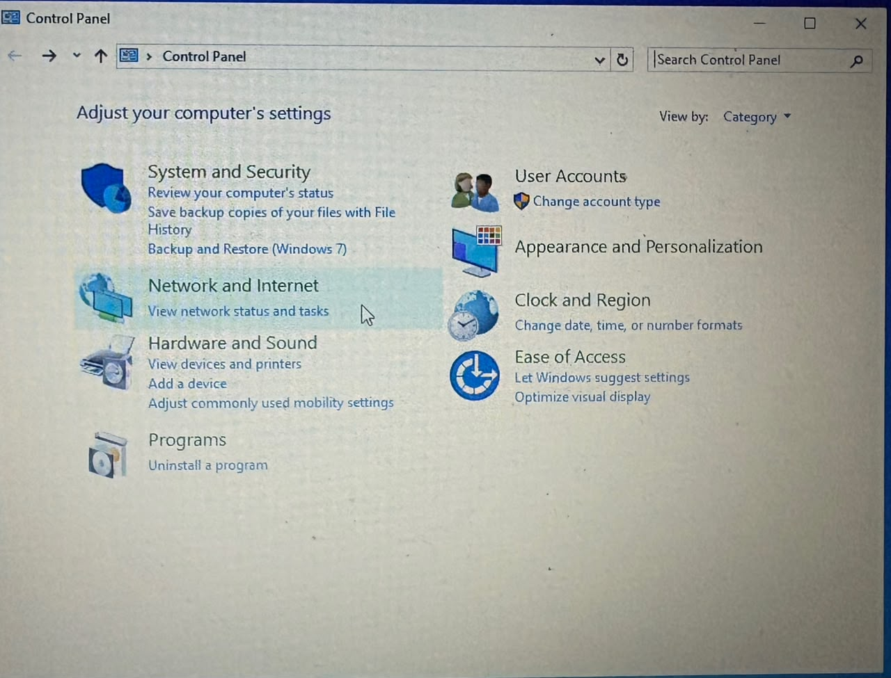
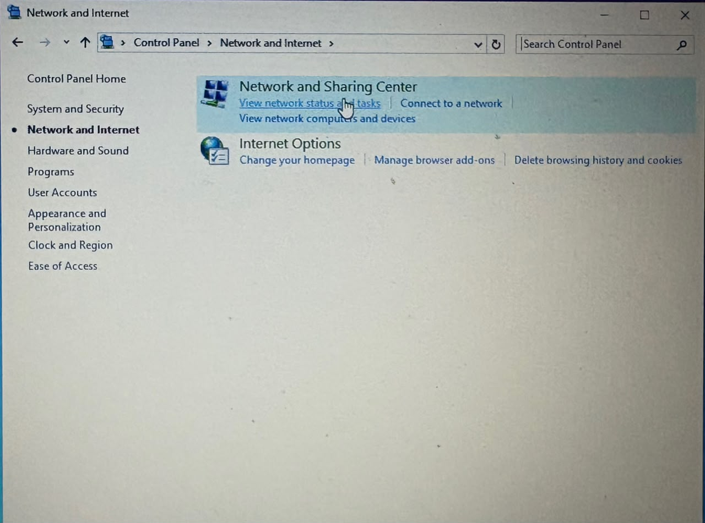
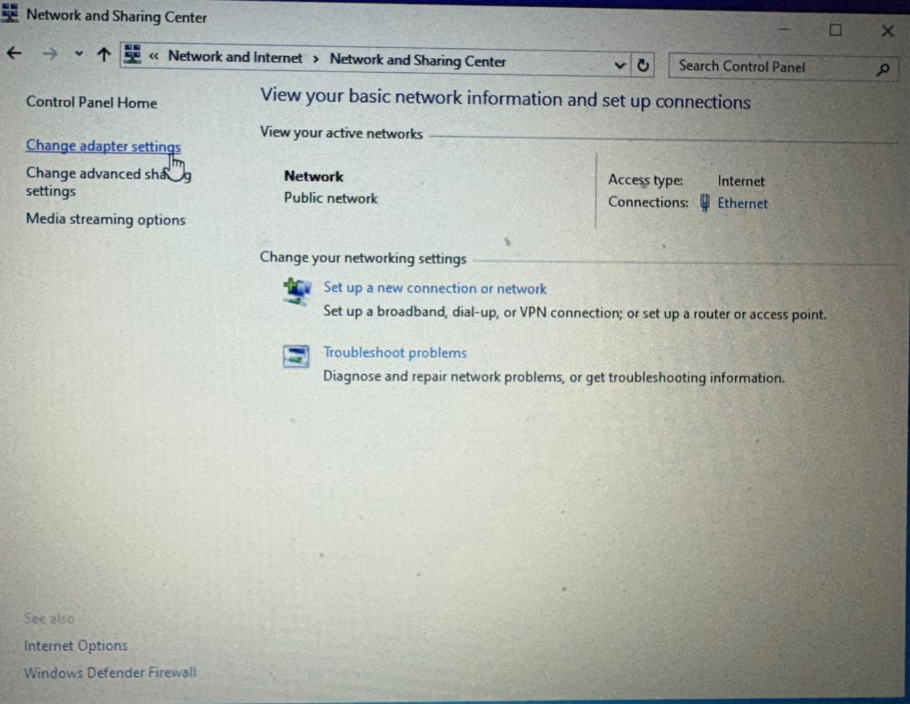
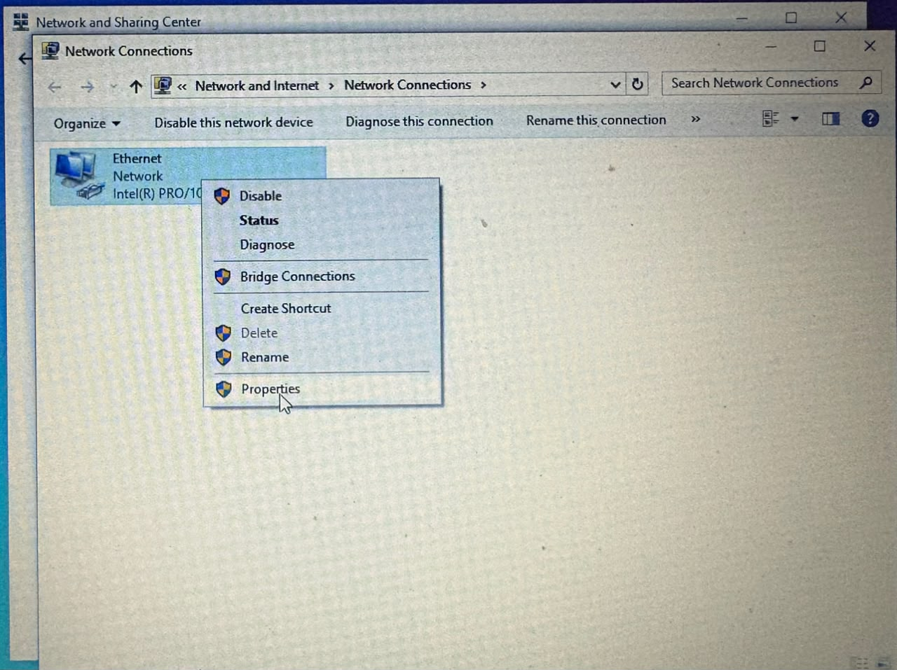
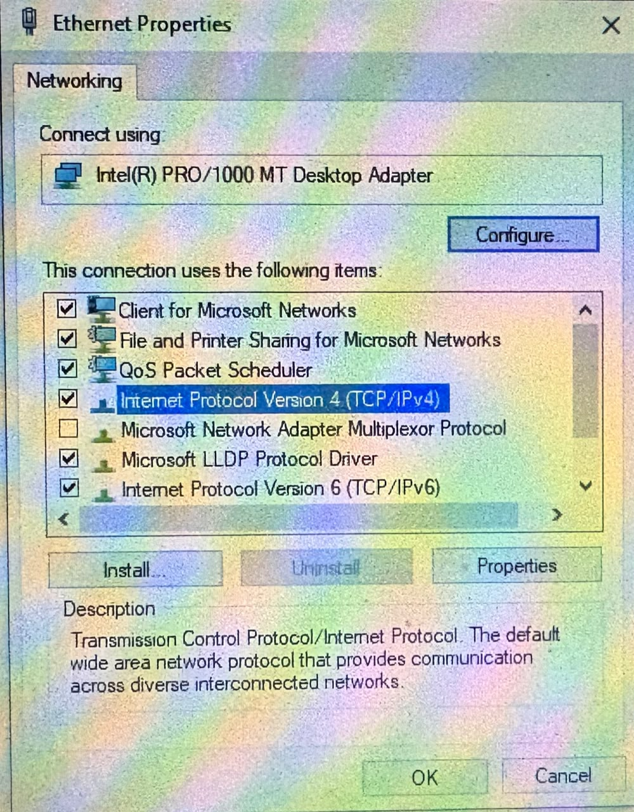
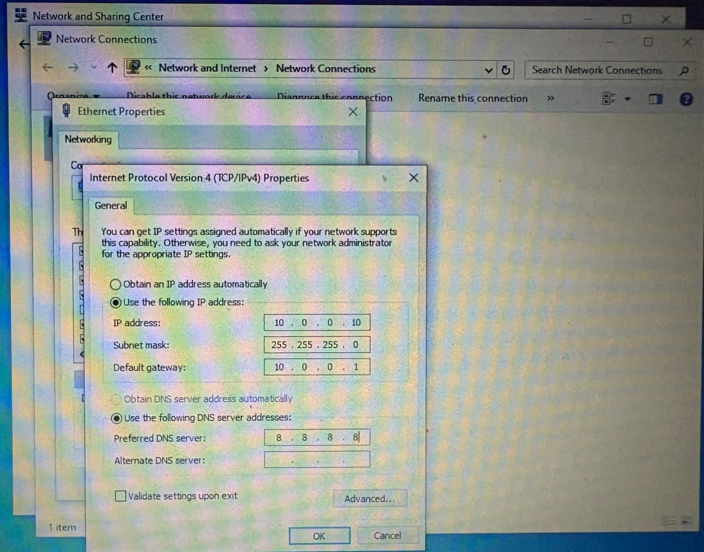
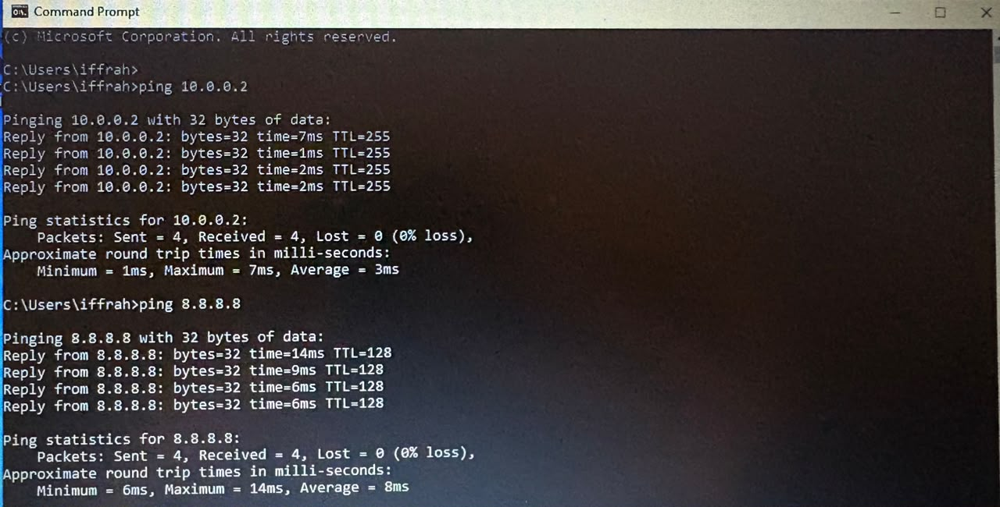
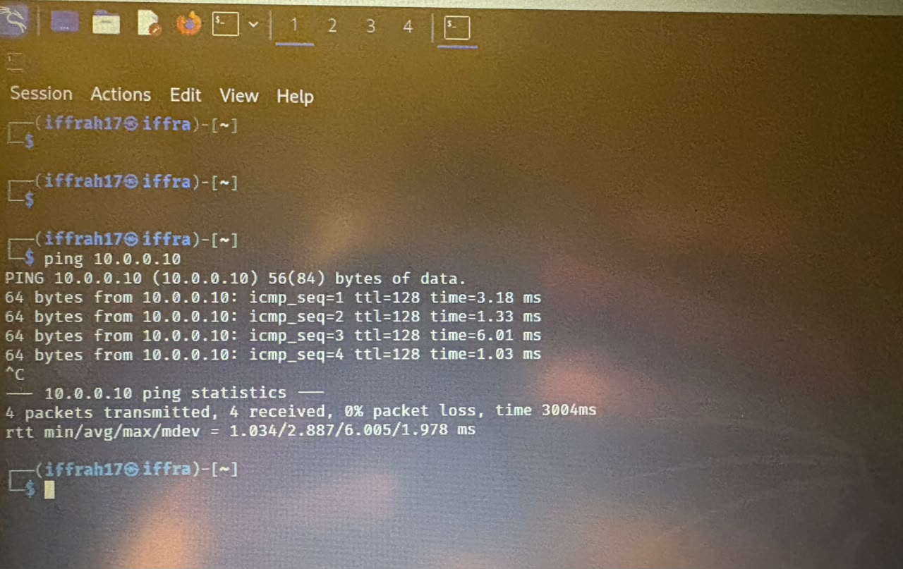

# networkwalks-b083-wk1-VM-Setup
Windows10 Virtual Machine setup inside virtual box.
# Purpose:
purpose of this setup is for cyberSecurity practice in an isloated enviornment.
## Why create this?
we can test suspicious files , commands and malware so that even if something goes wrong we have our windows10 protected. Kali-linux virtual machine is like an attacker's side and windows10 VM is like a victim's side.
# Requirements
*  VirtualBox already installed (same one used for Kali)
*  At least 40 GB free disk space
*  At least 4 GB RAM to spare for the VM
*  Kali Linux VM already set up with NAT Network, IP 10.0.0.2 .
# Set-up Instructions
# Download Windows 10 ISO 
# go to the Windows 10 download page scroll under windows 10 installation media and select download now.

# Run MediaCreationTool.exe.
# accept microsoft license and terms.
  
# choose installation media for other PC.
  
# select required language , windows 10 edition , 64-bit (x64) architecture.
  
# select ISO image.
  
# Wait for the Media Creation Tool to download Windows and create the ISO file.
# Create new VM in virtualBox
* open vitualBox click new
* name it Windows10-Lab
* select OS microsoft windows, version: Windows 10 (64-bit)
* memory = 4096 MB (4GB).
* create virtual hard disk , format = VDI , dynamically allocated.
* select ISO image and choose windows 10 ISO u downloaded.
* below are screenshots

  

  # Set the network to NAT network
  * shutdown VM.
  * go to settings> network
  * select attach to : NAT Network
  * in name select the same your kali-linux uses
  * start VM again.

    
 
    # Set static IP inside windows
    * Open Control Panel > Network and Sharing Center > Change adapter settings
    * • Right-click the network adapter, Properties
    * • Select Internet Protocol Version 4 (TCP/IPv4), Properties
    * • Use the following IP address: ◦
    * IP address: 10.0.0.10 ◦
    * Subnet mask: 255.255.255.0 ◦
    * Default gateway: 10.0.0.1 ◦
    * Preferred DNS: 8.8.8.8
 
   
   
   
   
   
   
  # test connectivity
  * Open Command Prompt on Windows
  *  Run: ping 10.0.0.2 (this should reach your Kali VM)
  *  Run: ping 8.8.8.8 (this should confirm internet access)
  *  On Kali, run: ping 10.0.0.10 (this should reach Windows)

  
  .

  # Challenges I faced:
  I faced a challenge while testing connectivity between the Windows 10 VM and the Kali Linux VM. The connectivity test from the Windows VM to the Kali Linux VM was successful. However, when I attempted to ping the Windows VM from Kali Linux, the packets failed to transmit on multiple attempts.
I troubleshot the issue and identified that the Windows Firewall was blocking inbound ICMP requests from the Kali Linux VM. After configuring the firewall to allow the required inbound requests, I successfully established connectivity and was able to ping the Windows VM from Kali Linux.
This troubleshooting process helped me understand how firewall rules can affect communication between virtual machines within a lab network
